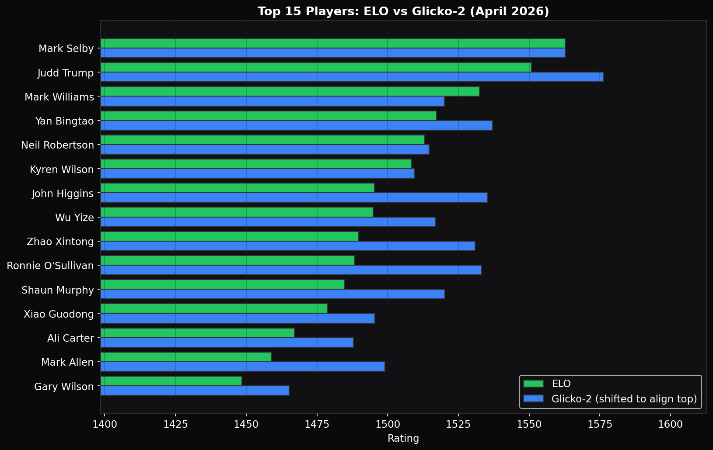
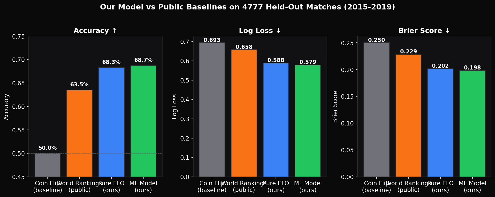
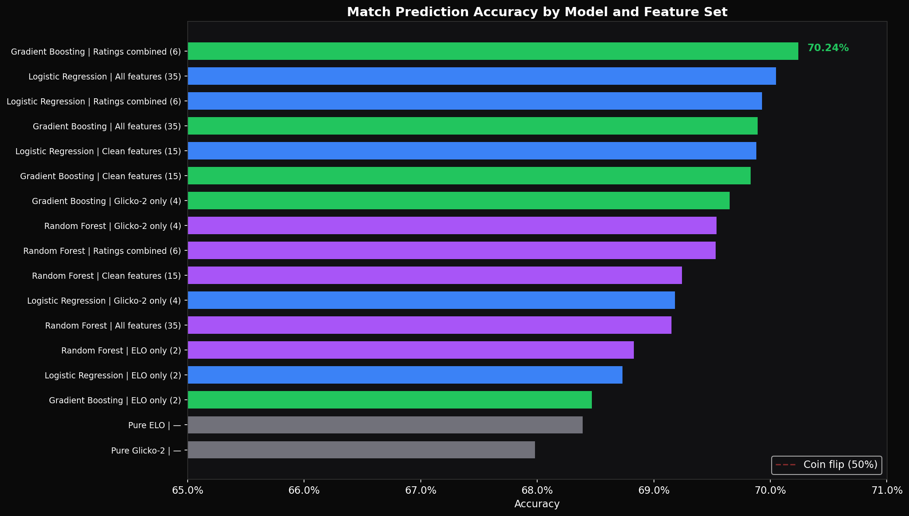
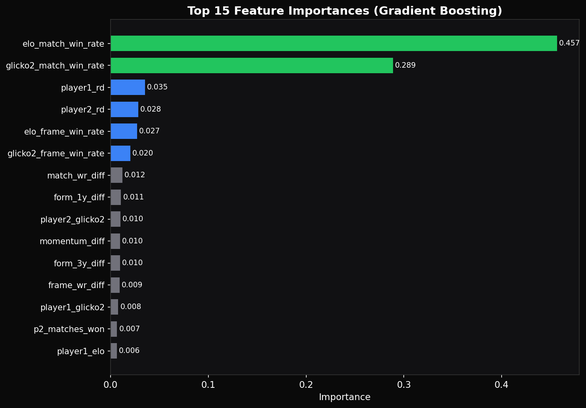
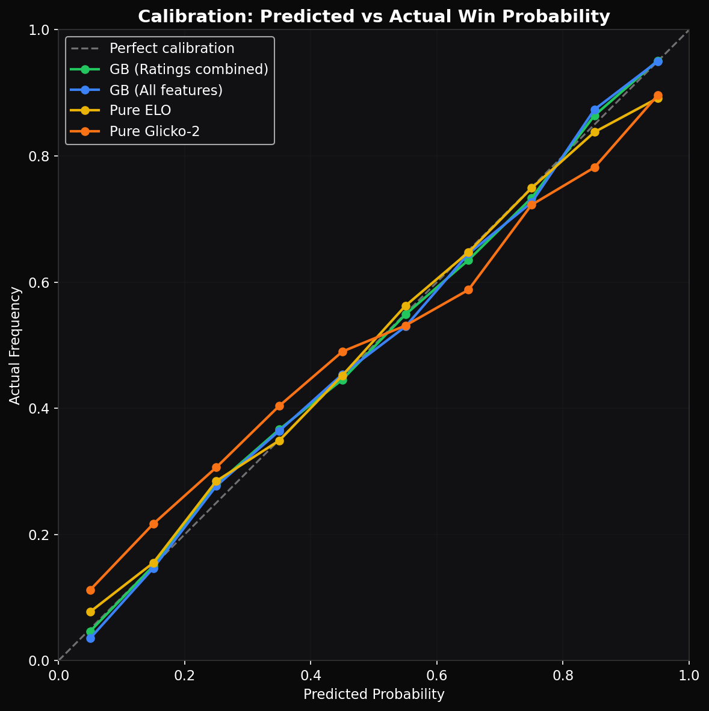
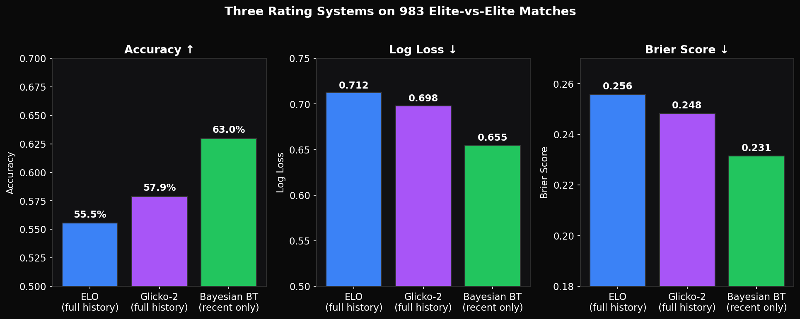
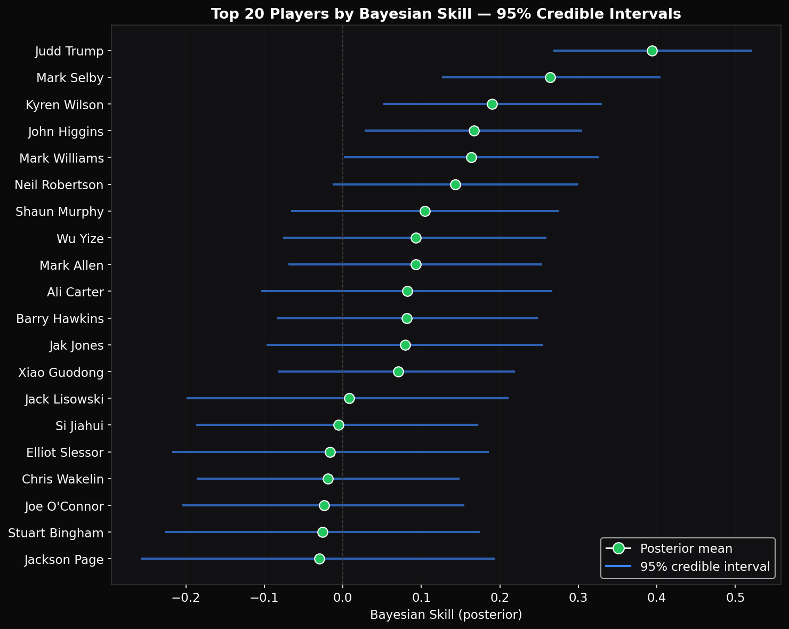

# Snooker Rating System

ELO and Glicko-2 rating systems for professional snooker, with ML match prediction models and a web application.

> This project grew out of [2025-Summer-Erdos-Elo-Project](https://github.com/PubohH/2025-Summer-Erdos-Elo-Project), a summer 2025 project at the Erdos Institute. The original project applied a basic ELO system to snooker. This repo is a complete rewrite with Glicko-2, MLE-optimized parameters, an incremental pipeline, and a full-stack web app.

## Live Demo

**https://cue-rating.onrender.com**

Hosted on Render's free tier. On first visit after idle (15 min), the server cold-starts and computes ratings for 117,530 matches (~45 seconds). After that, all pages load instantly. Refresh if you see a loading message.

Data last updated: April 7, 2026.

## Technical Writeup

A detailed paper-style writeup covering the methodology, parameter optimization, results, and feature analysis is in [docs/writeup.md](docs/writeup.md).

## Results

**117,530 matches** from 1982-2026 across **1,108 tournaments** and **3,832+ players**.

### Top 15 Active Players



### Beat the Public Baseline

On 4,777 held-out matches from 2015-2019, our gradient boosting model outperforms the official World Snooker Tour rankings by **5.2 percentage points in accuracy and 12% lower log loss**:



### ML Model Performance

15 model configurations tested across 5 feature sets and 3 classifiers. The best is Gradient Boosting on just 6 features (ELO and Glicko-2 predictions plus rating deviations) — adding more features doesn't help.



| Model | Features | Accuracy |
|-------|----------|----------|
| **Gradient Boosting** | **Ratings combined (6)** | **70.2%** |
| Logistic Regression | All features (35) | 70.1% |
| Gradient Boosting | All features (35) | 69.9% |
| Random Forest | Glicko-2 only (4) | 69.5% |
| Pure ELO baseline | — | 68.4% |
| Pure Glicko-2 baseline | — | 68.0% |

### Feature Importance

The two rating-system match win probabilities account for **74.5%** of the gradient boosting model's predictive power. The Glicko-2 RD (uncertainty) contributes another 6.3%.



### Calibration

A "70% prediction" should win ~70% of the time. Our best model achieves Expected Calibration Error of **0.011** — nearly perfect calibration.



### MLE-Optimized Parameters

| System | Parameter | Default | Optimized |
|--------|-----------|---------|-----------|
| ELO | K-factor | 8.0 | 9.77 |
| ELO | Divisor | 400 | 327.15 |
| Glicko-2 | Tau | 0.5 | 1.488 |

### Bayesian Bradley-Terry Extension

A third rating system: a fully Bayesian Bradley-Terry model fit via PyMC + NUTS sampling. Each player gets a full posterior distribution over skill, not just a point estimate. Predictions use posterior predictive averaging across 8000 samples for proper uncertainty propagation.

Restricted to 29 active players (≥100 matches in the past 2 years) to keep MCMC tractable. Sampling completes in ~5 seconds.

**On 983 elite-vs-elite matches**, the Bayesian model wins on all three metrics:



The Bayesian model wins on this restricted slice because (1) it uses recent data only, while ELO and Glicko-2 carry years of cumulative history that lag current form, and (2) posterior predictive averaging produces better-calibrated probabilities than single point estimates. On the broad test set, the gradient boosting model is still better (Bayesian only covers 29 players), but the Bayesian extension adds principled uncertainty quantification — a feature ELO and Glicko-2 cannot offer.

**Posterior credible intervals** for each top player — wider intervals mean less data or more variability:



See [docs/bayesian_bt_explained.md](docs/bayesian_bt_explained.md) for a teaching-style derivation of the model.

## Architecture

```
snooker_elo/
├── src/snooker_elo/
│   ├── ratings/          # ELO + Glicko-2 implementations
│   │   ├── base.py       # RatingSystem ABC, shared interface
│   │   ├── elo.py        # Frame-weighted ELO (0.34s for 115K matches)
│   │   ├── glicko2.py    # Full Glickman algorithm with RD + volatility
│   │   └── optimization.py  # MLE parameter optimization
│   ├── data/
│   │   ├── loader.py     # Data loading + validation
│   │   └── scraper.py    # cuetracker.net scraper with rate limiting
│   ├── features/
│   │   └── generator.py  # O(T·M) incremental feature pipeline
│   ├── models/
│   │   └── classification.py  # LR, RF, Gradient Boosting
│   ├── evaluation/
│   │   ├── metrics.py    # Log-loss, Brier, calibration, ECE
│   │   └── comparison.py # ELO vs Glicko-2 comparison framework
│   └── web/
│       ├── app.py        # FastAPI backend
│       └── engine.py     # Precomputed rating engine
├── frontend/             # React SPA (Vite + Recharts)
├── tests/                # 42 tests (pytest)
├── data/raw/             # matches.csv (115K matches)
└── legacy/               # Original Erdos Institute project
```

## Quick Start

### Install

```bash
pip install -e ".[dev]"
```

### Run Tests

```bash
pytest -v
```

### Start the API

```bash
pip install -e ".[web]"
uvicorn snooker_elo.web.app:app --reload
```

API docs at http://localhost:8000/docs

### Start the Frontend

```bash
cd frontend
npm install
npm run dev
```

Open http://localhost:3000

### Docker

```bash
docker compose up --build
```

## API Endpoints

| Method | Endpoint | Description |
|--------|----------|-------------|
| GET | `/api/ratings?system=elo&top=50` | Player rankings |
| GET | `/api/player/{name}` | Player profile + recent matches |
| POST | `/api/predict` | Match prediction (body: `{player1, player2, best_of}`) |
| GET | `/api/comparison` | ELO vs Glicko-2 comparison |
| GET | `/api/search?q=Trump` | Player search |
| GET | `/api/stats` | Dataset statistics |

## How It Works

### ELO Rating (adapted for snooker)

Unlike chess ELO, this system rates **frame win probability**, not match win probability:

- **Expected frame win rate**: `E = 1 / (1 + exp((R2 - R1) / 327))`
- **Update**: `R_new = R + K × total_frames × (actual_rate - expected_rate)`
- **Match win probability**: Derived via binomial formula from frame probability

The frame-based approach enables predicting exact match scores (e.g., P(5-3) in best-of-9).

### Glicko-2

Extends ELO with two additional parameters per player:

- **Rating Deviation (RD)**: Uncertainty in the rating. High RD = less certain (new/inactive players).
- **Volatility**: How consistent a player's performance is.

Players returning from breaks (e.g., Zhao Xintong after 2023-2024 ban) automatically get higher RD, making predictions less confident — something ELO cannot express.

### Parameter Optimization

Parameters are chosen via **Maximum Likelihood Estimation**, not manual tuning:

```
LL = Σ [frames_won_i × log(p_i) + frames_lost_i × log(1 - p_i)]
```

Maximized using `scipy.optimize.minimize` over the full match history.

## Data

- **1982-2020**: Kaggle dataset (cuetracker.net origin)
- **2020-2025**: Scraped from cuetracker.net
- **Format**: `player1, player2, score1, score2, best_of, tournament_id, date, year`
- Player1 is always the winner (`score1 >= score2`)

### Scrape New Data

```bash
pip install -e ".[scraping]"
python -c "
from snooker_elo.data.scraper import scrape_new_matches
new = scrape_new_matches('data/raw/matches.csv', years=[2025, 2026])
"
```

## Performance

| Operation | Time |
|-----------|------|
| ELO: process 115K matches | 0.34s |
| Glicko-2: process 115K matches | 2.1s |
| Feature generation (300 tournaments) | 5.7s |
| Full API startup | 2.6s |
| MLE optimization (ELO) | ~135s |

## Testing

```
42 tests covering:
- ELO update formula, known value regression
- Binomial match probability (all formats)
- Glicko-2 core math, RD inflation, paper test vectors
- Feature generation: no data leakage, swap correctness
- Real data integration tests
```
